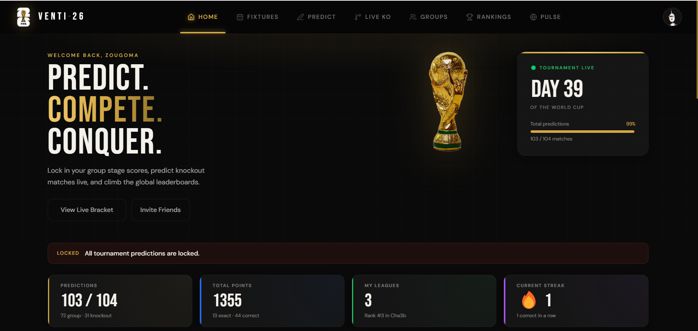
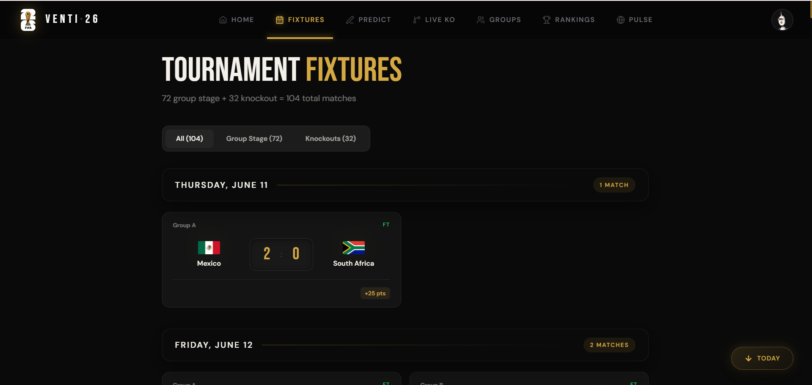
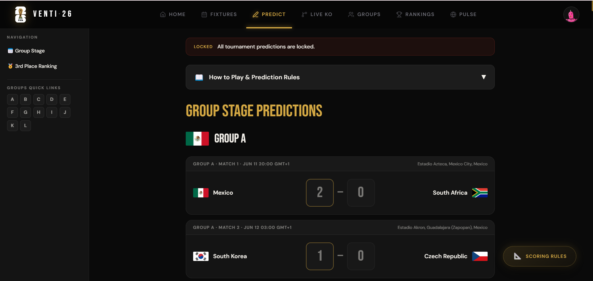
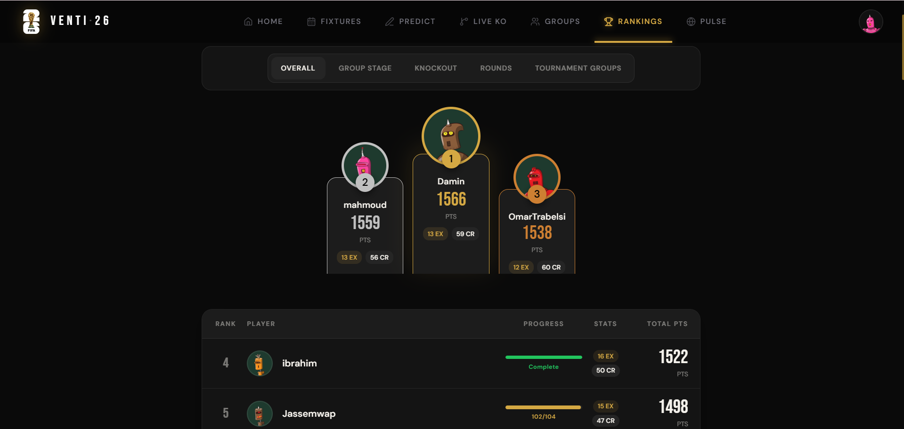
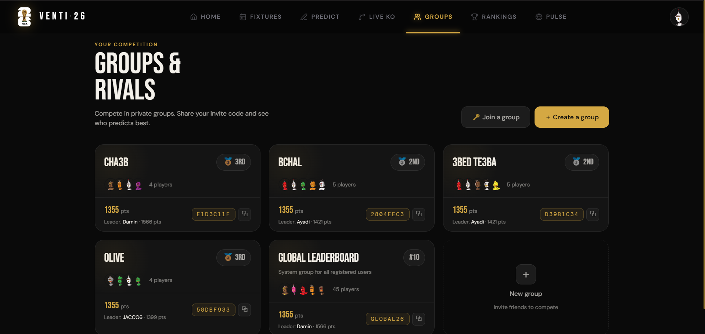
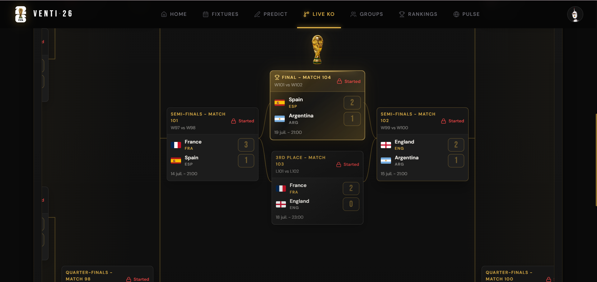
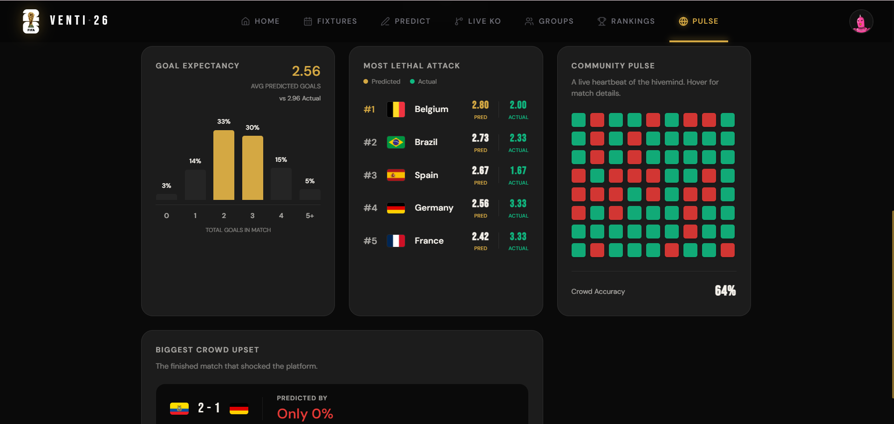

<div align="center">
  
  

  # 🏆 World Cup 2026 Dashboard
  
  *A sleek, high-performance web application built to track, predict, and engage with the 2026 World Cup.*

  [](https://nextjs.org/)
  [](https://supabase.com/)
  [](https://tailwindcss.com/)
  [](https://www.framer.com/motion/)

  <br />
  <br />
  

</div>

---

## 📖 About The Project

This dashboard was created as a passion project for the 2026 World Cup. It allowed users to track live matches, form private leagues with friends, and compete by predicting match outcomes. 

Designed with a heavy focus on **UI/UX**, the application leverages smooth micro-animations, real-time data syncs, and a premium aesthetic to keep users engaged throughout the month-long tournament.

> **Note:** The 2026 World Cup has officially concluded. This repository is now archived and serves as a portfolio piece showcasing full-stack Next.js and Supabase development.

---

## 📈 Milestones & Impact

Despite being a side project, the application saw incredible engagement over the course of the tournament:

- 👥 **50** Registered Users
- 🎯 **2,352** Total Match Predictions Submitted *(~47 predictions per user!)*
- 🛡️ **6** Active Private Leagues & Groups Created
- ⚡ **10,000+** Real-time Database Operations Handled Smoothly

---

## ✨ Core Features

*   **Live Match Tracking:** Real-time updates for all World Cup games, scores, and standings.
*   **Private Leagues:** Custom group creation with invite codes for localized leaderboards.
*   **Dynamic Predictions:** A specialized scoring algorithm awarding points based on correct match outcomes and exact scorelines.
*   **Premium Interface:** Fully responsive, accessible, and heavily animated using Framer Motion.

---

### 📸 Application Gallery

<p align="center">
  
   
</p>
<p align="center">
  
  
</p>
<p align="center">
  
  
</p>

---

## 🛠️ Technical Retrospective

Building a real-time, high-engagement app for a major event presented unique challenges and fantastic learning opportunities.

### 💡 Lessons Learned
*   **Real-time State Management:** Utilizing Supabase's real-time subscriptions taught valuable lessons in optimistic UI updates and keeping the client state perfectly synced with the database.
*   **Rapid Prototyping:** The combination of Next.js App Router and Supabase Auth/Postgres proved to be an unmatched stack for moving quickly from idea to production.

### 🚧 Challenges & Fixes
| Challenge | Solution |
| :--- | :--- |
| **High Traffic Spikes**<br>Simultaneous logins and queries right before a match started. | **Optimized Caching & Indexes:** Implemented Next.js server-side caching and added custom Postgres indexes on the `predictions` table to drastically reduce DB load. |
| **Scoring Consistency**<br>Ensuring everyone's points updated at the exact moment a match ended. | **Background Workers:** Extracted the scoring logic from the client into a reliable, isolated background script (`scripts/check_scores.js`). |
| **Timezone Confusion**<br>Users in different countries misinterpreting kick-off times. | **Client-side Formatting:** Standardized all database timestamps to UTC, leveraging native `Intl.DateTimeFormat` to seamlessly display local times on the frontend. |

---

## 💻 Local Development Setup

Want to explore the codebase locally? Follow these steps:

1. **Clone & Install:**
   ```bash
   git clone https://github.com/your-username/venti26.git
   cd venti26
   npm install
   ```

2. **Environment Variables:**
   Create a `.env.local` file at the root. You will need a Supabase project set up.
   ```env
   NEXT_PUBLIC_SUPABASE_URL=your_supabase_url
   NEXT_PUBLIC_SUPABASE_ANON_KEY=your_supabase_anon_key
   ```

3. **Run the App:**
   ```bash
   npm run dev
   ```
   *Navigate to [http://localhost:3000](http://localhost:3000)*

---

## 📁 Repository Map

*   `📁 /src` - Core Next.js React codebase (App Router, Components, Lib).
*   `📁 /supabase` - Database migrations, types, and configuration.
*   `📁 /scripts` - Custom node scripts used during the tournament (Scoring, Stats, Validation).

## 📄 License
Distributed under the MIT License. See `LICENSE` for more information.
